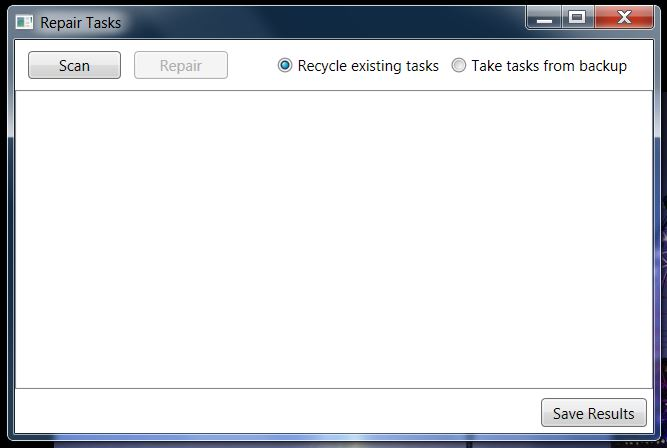

_This page describes the beta release._

Firstly, we will need to understand a little about how tasks are described in Windows.

Windows keeps most of the detail about a task in an XML file held under \Windows\System 32\Tasks. Task files are held in a directory tree, and are referred to using the relative path, for example “Microsoft\Windows\RAC\RacTask”. 

A correctly configured task also has three separate registry entries, one of which contains a hash of the XML file.  The message "The task image is corrupt or has been tampered with" indicates that the hash in the registry does not match the current state of the XML file.

The solution to the problem is to delete the registry entries and XML file from Windows, and reinstall the task by passing a copy of the XML file to the system utility ‘schtasks’.

The program supplied by this project, RepairTasks, looks like this:

_Scan_ causes RepairTasks to walk the directory tree under \Windows\System 32\Tasks. For each task, RepairTasks uses schtasks in query mode to see whether the task is correctly set up. It looks for two errors in particular: the aforementioned, "The task image is corrupt or has been tampered with", and also “The system cannot find the file specified”. This second error indicates that the registry entries for the task are missing.  Each task for which any error is reported is added to a list of tasks to be repaired.

_Repair_ causes RepairTasks to go through the list of tasks to be repaired, repairing each using the steps described above.

_Save_ prompts for a log file in which to save the results of the last Scan or Repair

By default, with the 'Recycle existing tasks' radio button checked, RepairTasks will reinstall the task file that is already there. However, sometimes this will not work. For instance, when Windows 10 is reverted to Windows 7, it seems that the registry entries are restored, but the task files are not, thus invalidating the hashes stored in the registry and causing the errors. Sometimes, reinstalling the Windows 10 task file under Windows 7 will fail with errors such as “The task XML contains a value which is incorrectly formatted or out of range".  In such cases, RepairTasks restores the erroneous task file to the Windows directory so that the problem will be picked up on the next Scan (albeit as a task with missing registry entries, as they had to be deleted before the reinstall could be attempted). But clearly, going round again with the same task file won't help; a Windows 7 task XML file is needed. So, with the ‘Take tasks from backup’ radio button checked, RepairTasks will prompt for a folder containing suitable task XML files to use instead. A backup is the ideal source, but I have provided a set of task files from a clean Windows 7 installation as an additional download that can supply this need.

A detailed description of the steps required can be found in one of the Discussions, [here](https://repairtasks.codeplex.com/discussions/644159).

