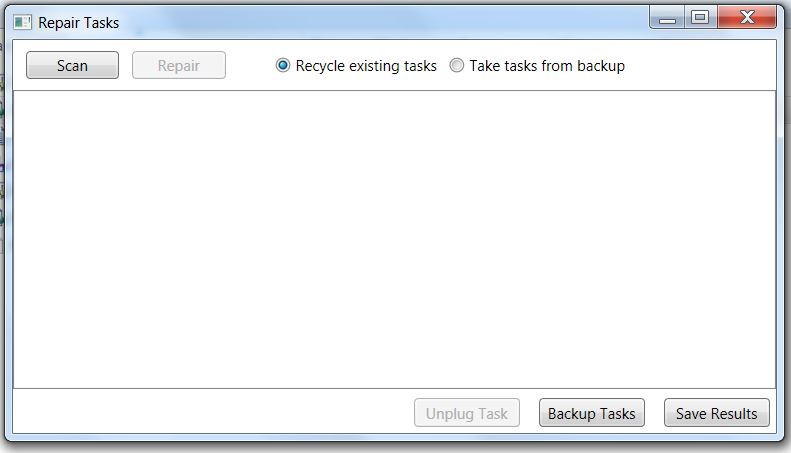

if you are dealing with problems having reverted from Windows 10 to Windows 7 or 8.1, and you are in a hurry, you can try this [Walk-through](Walk-through.md).  For the full story, read on.

Firstly, we will need to understand a little about how tasks are described in Windows.

Windows keeps most of the detail about a task in an XML file held under \Windows\System32\Tasks. Task files are held in a directory tree, and are referred to using the relative path, for example “Microsoft\Windows\RAC\RacTask”. 

A correctly configured task also has three to five separate registry entries, one of which contains a hash of the XML file.  The message "The task image is corrupt or has been tampered with" indicates that the hash in the registry does not match the current state of the XML file.

The solution to the problem is to delete the registry entries and XML file from Windows, and reinstall the task by passing a copy of the XML file to the system utility ‘schtasks’.

The program supplied by this project, RepairTasks, looks like this:

To start it, first copy the two files from RepairTasks.zip to a folder of your choice and then run RepairTasks.exe. The copying step is recommended because RepairTasks must run with administrative privileges, and some users have found that it will not do so if run from within the zip file.

_Scan_ causes RepairTasks to walk the directory tree under \Windows\System 32\Tasks. For each task, RepairTasks uses schtasks in query mode to see whether the task is correctly set up. It looks in particular for the aforementioned, "The task image is corrupt or has been tampered with", but every task for which any error is reported is added to a list of tasks to be repaired.

_Repair_ causes RepairTasks to go through the list of tasks to be repaired, repairing each using the steps described above, i.e. the registry entries and the task file are deleted, and RepairTasks attempts to reinstall the task. If repair fails, an attempt is made to restore the task file and registry entries to their original state.  If this fails, the task will appear as 'not installed' in the next Scan, and another Repair attempt can be made. 

_Unplug Task_ unplugs the task selected in the results window from Task Scheduler.  It does this by removing the registry entries, so that Task Scheduler is no longer aware of the task. However, it leaves the task file intact under Windows\System32\Tasks, so that it will continue to appear in a Scan, and can be repaired in the future. Once a task has been unplugged, it can be permanently removed from the system by deleting the task file under Windows\System32\Tasks.

_Backup Tasks_ prompts for a directory in which to make a backup copy of all the task files under \Windows\System 32\Tasks. Each backup copy is date and time stamped, so that multiple backups may be created.

_Save Results_ prompts for a log file in which to save the results of the last Scan or Repair

I recommend that you use RepairTasks as follows:
# Scan for errors. If there are none, you are done.
# Before attempting Repair, use Backup Tasks to save the current state of the task files.
# Repair with the 'Recycle existing tasks' radio button checked. RepairTasks will reinstall the existing task files, preserving any settings that they contain. Often, this will fix all outstanding problems, and you're done.
Sometimes, task file installations will fail. When Windows 10 is reverted to Windows 7 or 8.1, it restores the Windows 7 or 8.1 registry entries, but leaves behind Windows 10 task files.  In most cases, these can be reinstalled, but sometimes their content is not acceptable to Windows 7 or 8.1. A typical failure is “'ERROR: The task XML contains a value which is incorrectly formatted or out of range.(2,8):version:1.5". To get out of this, it is necessary to provide a valid Windows task XML file. This can come from the ‘Windows7 Tasks.zip’ download that I provide, containing the Windows 7 task files from a clean installation, or, for Windows 8.1, the separate ‘Windows8.1 Tasks.zip’ download, or a backup, if you have one; or another Windows 7 or 8.1 system. There are also tasks added in more recent versions of Windows 10 that run code that does not exist at all in Windows 7 or 8.1, and therefore can be left unrepaired and unplugged, which is fine as they are visible only to RepairTasks, or removed from the system by deleting the task files from System32\Tasks (but be careful to get the right ones!).
* To use standard Windows 7 task files, download the Windows7 Tasks.zip file, then Repair with the ‘Take tasks from backup’ radio button checked. In the dialog that opens, select the Windows7 Tasks.zip file in its downloaded location.  For Windows 8.1, do the same thing, but with the Windows8.1 Tasks.zip file. For each task to be repaired, RepairTasks looks inside the zip file for the corresponding task file from a clean Windows 7 or 8.1 installation. If there is one, it uses it to repair the task; otherwise the task is left unchanged. It is not necessary to unzip the downloaded file.  If you do, you will need to replace all underscores in file and path names with blanks. If you use the zip file without unzipping it, this is taken care of for you.
* To use an alternative source of task files, again Repair with the ‘Take tasks from backup' radio button checked, but instead select a folder containing the task XML files. The folder subtree will be searched for task files with the same names as the tasks to be repaired and that are either in the root folder of the subtree, or in a folder with the same name as the folder containing the task to be repaired in Windows\System32\Tasks.  If you are taking the files from a backup or another Windows 7 system, a good approach is to first set up a temporary folder to use as the source. Copy the contents of the Windows\System32\Tasks directory to your temporary folder. Alternatively, the backup folder you created in step 1 can also be used as the source of the tasks.
* Tasks that occur only on Windows 10 are listed here: [Windows 10 only tasks](Windows-10-only-tasks). If anybody encounters other tasks that they think should be on this list, please let me know.
In general, use Repair with 'Recycle existing tasks' when you can, because it preserves existing settings.

_This page describes version 3.3. For version 2.2, see_ [Version 2.2](Version-2.2).  _For the beta release see_  [Beta version](Beta-version)

