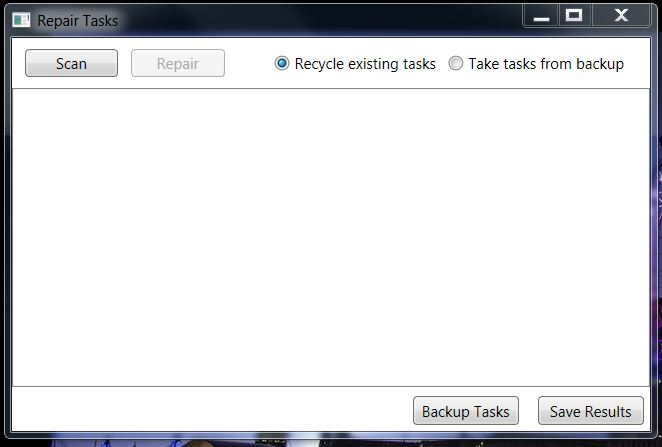

Firstly, we will need to understand a little about how tasks are described in Windows.

Windows keeps most of the detail about a task in an XML file held under \Windows\System 32\Tasks. Task files are held in a directory tree, and are referred to using the relative path, for example “Microsoft\Windows\RAC\RacTask”. 

A correctly configured task also has three to five separate registry entries, one of which contains a hash of the XML file.  The message "The task image is corrupt or has been tampered with" indicates that the hash in the registry does not match the current state of the XML file.

The solution to the problem is to delete the registry entries and XML file from Windows, and reinstall the task by passing a copy of the XML file to the system utility ‘schtasks’.

The program supplied by this project, RepairTasks, looks like this:

_Scan_ causes RepairTasks to walk the directory tree under \Windows\System 32\Tasks. For each task, RepairTasks uses schtasks in query mode to see whether the task is correctly set up. It looks in particular for the aforementioned, "The task image is corrupt or has been tampered with", but every task for which any error is reported is added to a list of tasks to be repaired.

_Repair_ causes RepairTasks to go through the list of tasks to be repaired, repairing each using the steps described above, i.e. the registry entries and the task file are deleted, and RepairTasks attempts to reinstall the task. If repair fails, an attempt is made to restore the task file and registry entries to their original state.  If this fails, the task will appear as 'not installed' in the next Scan, and another Repair attempt can be made. 

_Backup Tasks_ prompts for a directory in which to make a backup copy of all the task files under \Windows\System 32\Tasks. Each backup copy is date and time stamped, so that multiple backups may be created.

_Save Results_ prompts for a log file in which to save the results of the last Scan or Repair

I recommend that you use RepairTasks as follows:
# Scan for errors. If there are none, you are done.
# Before attempting Repair, use Backup Tasks to save the current state of the task files.
# Repair with the 'Recycle existing tasks' radio button checked. RepairTasks will reinstall the existing task files, preserving any settings that they contain. Often, this will fix all outstanding problems, and you're done.
# Repair with the ‘Take tasks from backup' radio button checked. Sometimes, task file installations will fail. When Windows 10 is reverted to Windows 7, it restores the Windows 7 registry entries, but leaves behind Windows 10 task files.  In most cases, these can be reinstalled, but sometimes their content is not acceptable to Windows 7. A typical failure is “'ERROR: The task XML contains a value which is incorrectly formatted or out of range.(2,8):version:1.5". To get out of this, it is necessary to provide a valid Windows 7 task XML file. This can come from a backup, if you have one; or another Windows 7 system; or from the ‘Windows7 Tasks.zip’ download that I provide.

To tell my tool to use an external source of task XML files, select the ‘Take tasks from backup’ radio button before pressing Repair. The program will prompt for a folder containing the task XML files. A good approach is to first set up a temporary folder to hold these files. If you are taking the files from a backup or another Windows 7 system, copy the contents of the Windows\System32\Tasks directory to your temporary folder. If you are using my download, unzip its contents to your temporary folder. Then, when prompted, specify the Tasks folder within your temporary folder as the source of the tasks. The backup folder you created in step 1 can also be used as the source of the tasks..

But, in general, use Repair with 'Recycle existing tasks' when you can, because it preserves existing settings.

